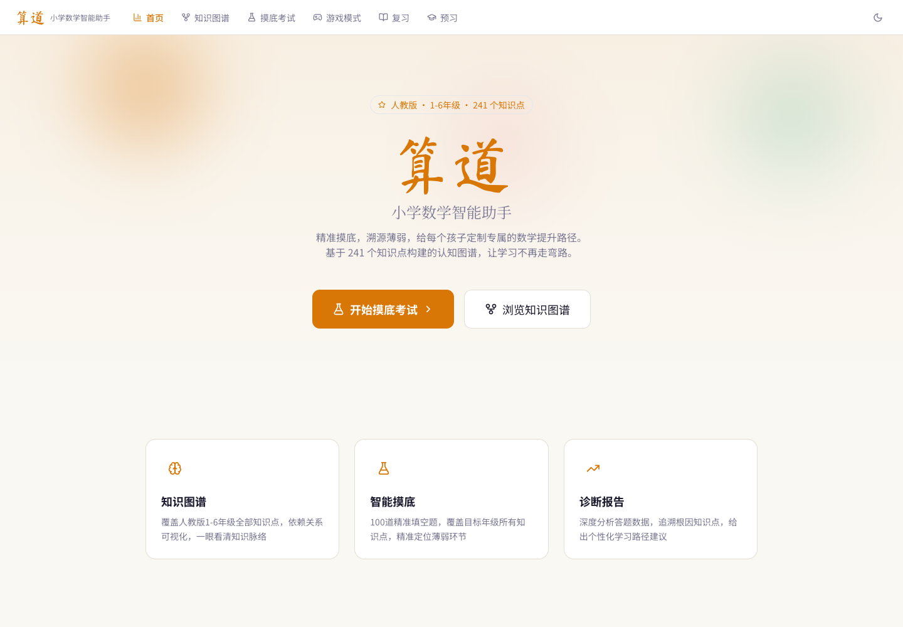
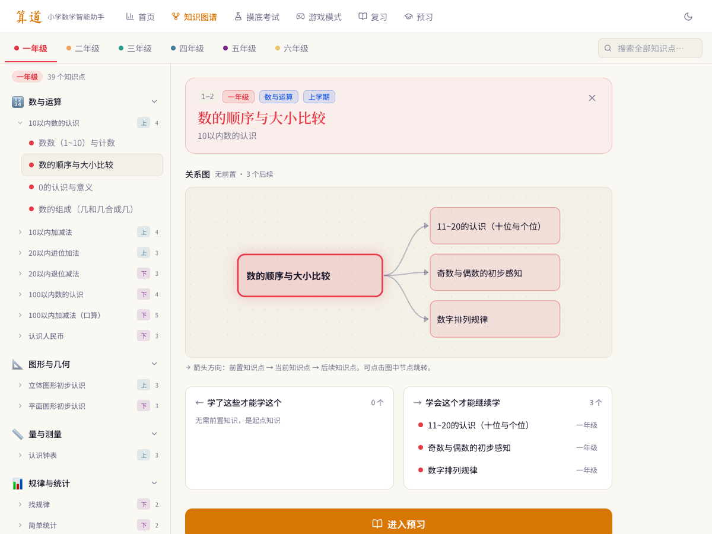
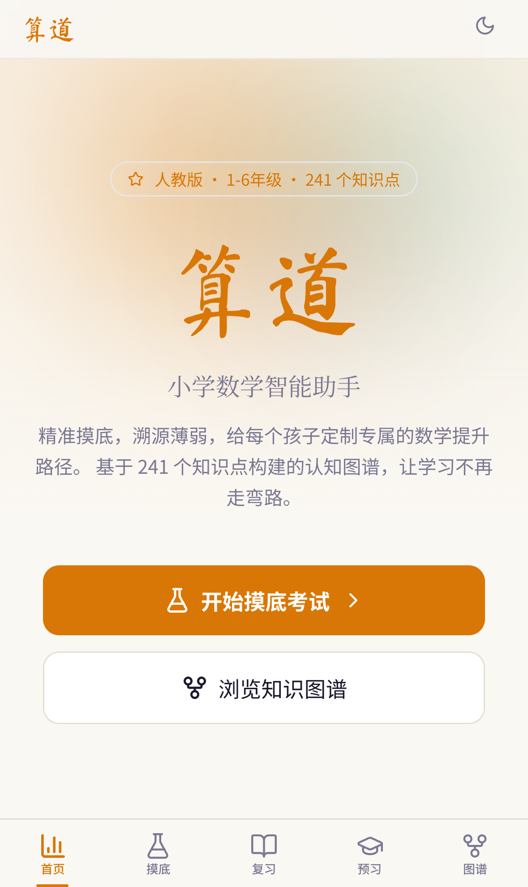
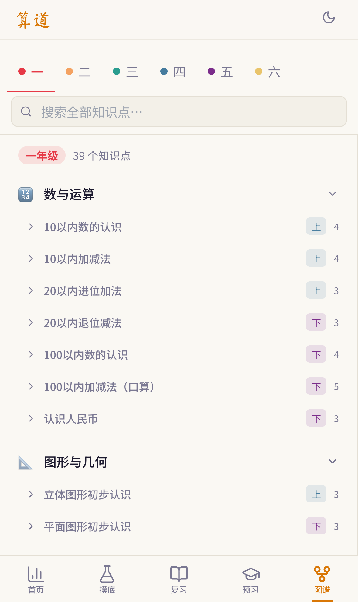
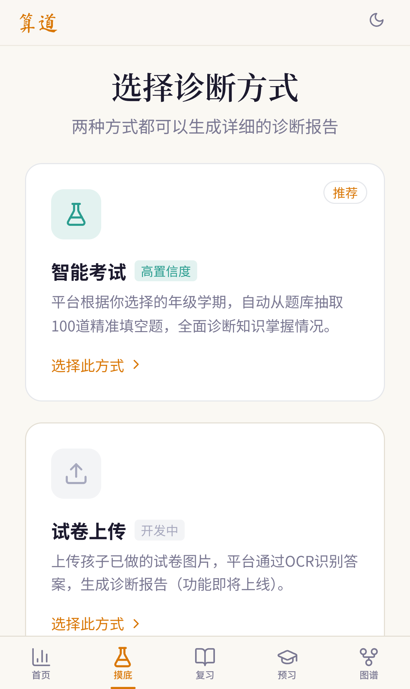
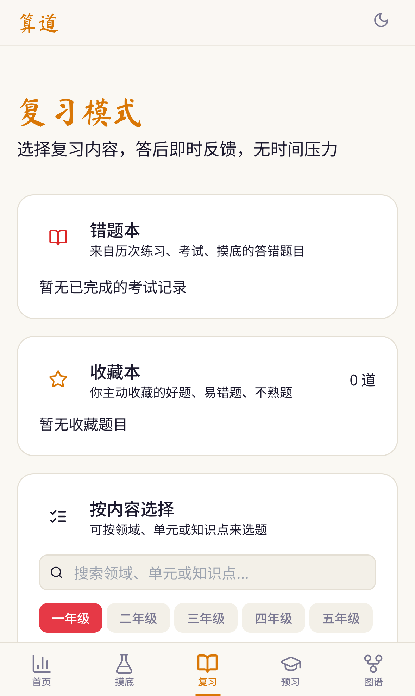

# 算道 · 小学数学智能学习平台

算道是一个面向小学一至六年级学生与家庭的智能数学学习平台，提供知识图谱、摸底诊断、复习、预习、可治理题库与流式 AI 辅导。

[](https://github.com/Erchoc/suan/actions/workflows/ci.yml)
[](https://deploy.workers.cloudflare.com/?url=https://github.com/Erchoc/suan)

- 在线地址：[https://suan.longye.site](https://suan.longye.site)
- 开源协议：[MIT](LICENSE)
- 质量报告：[99 / 100](docs/质量报告.md)

## 界面预览

### 首页（桌面端）



### 知识图谱（桌面端）



### 移动端

<p align="center">
  
  
  
  
</p>

<p align="center"><sub>首页 · 知识图谱 · 摸底考试 · 复习</sub></p>

## 产品方向与商业化假设

算道不把“搜答案”或开放式 AI 对话当作核心价值。产品要从学习工具原型演进为一套**真实作业驱动的结果交付系统**：家长上传真实作业或试卷，平台定位薄弱原因，生成短时练习计划，通过同技能复测证明是否掌握，最后把结果用家长看得懂的方式呈现。

核心闭环是：

```text
真实作业进入 → 知识点诊断 → 每日 10 分钟任务 → 同技能复测 → 家长结果报告
```

近期优先级：

1. 家长账号、孩子档案与云端学习记录。
2. 拍作业/试卷诊断和短时自适应摸底。
3. 每日 10 分钟计划、同技能复测与成长账本。
4. 家长周报、跨设备同步和微信服务入口。
5. 受限的逐步提示式 AI 老师；小学阶段不默认开放通用聊天。

价格验证应从结果交付而不是功能数量出发：`9.9 元`适合单次深度诊断，`29.9–39.9 元/月`适合云端错题本、同步和周报，`69–99 元/月`作为个性化计划、受限 AI 与复测证明的主力订阅；`199 元/月`以上需要人工审核或持续服务，纯软件不支持 `599–999 元/月`的价值承诺。

本期先建设 D1 题库资产与管理后台，因为可追踪、可审核、可发布的内容供应链，是后续真实作业诊断、复测证明和规模化内容运营的基础。

## 当前架构

仓库是根目录单包全栈应用，前端与接口由同一套开发和部署流程管理：

```text
浏览器
├── Vite 构建的 React 单页应用
│   ├── 学生端题库只读取 D1 已发布版本
│   └── /console 题库资产后台
└── 同源 /api/* 请求
    └── Hono Cloudflare Worker
        ├── /api/health
        ├── /api/questions 与 /api/admin/*
        │   └── Cloudflare D1（草稿、发布快照、版本、审计）
        └── /api/ai/chat → 可配置 AI 上游
```

- 前端：Vite 8、React 18、TypeScript、React Router、Tailwind CSS、Zustand
- 图谱与图表：`@xyflow/react`、Dagre、Recharts
- 接口：Hono，运行于 Cloudflare Workers
- 内容数据库：Cloudflare D1；后台编辑与学生端发布快照分离
- 静态资源：由 Worker Assets 托管，未知前端路由回退到单页应用
- 部署配置：`wrangler.jsonc` 顶层使用独立的 `suan-starter` 并可部署到 `*.workers.dev`，项目生产环境才使用 `suan` 与 `env.production` 中的 `suan.longye.site/*`

## 一键部署到 Cloudflare

[](https://deploy.workers.cloudflare.com/?url=https://github.com/Erchoc/suan)

点击按钮后，Cloudflare 会将本项目复制到你的 GitHub 或 GitLab 账号，创建 Worker、自动预配 D1 binding，并配置 Workers Builds。部署页会读取 `.env.example` 中声明的配置；`API_KEY` 与 `ADMIN_SESSION_SECRET` 会作为加密的 Worker Secret 保存，不会写入仓库。

默认部署到你自己 Cloudflare 账号下的独立 `*.workers.dev` 地址，不会占用本项目的生产域名。需要提前准备：

- Cloudflare 账号
- GitHub 或 GitLab 账号
- DeepSeek API Key
- 一段至少 24 个字符、只用于本项目的随机 `ADMIN_SESSION_SECRET`

D1 是线上题库的唯一数据源。首次部署需要在部署环境应用 `migrations/` 并执行一次幂等题库初始化，具体命令见下文；未初始化时题库接口会明确返回不可用，不再回退公开 JSON。

## 本地开发

环境要求：Node.js 22.13.0 或更高版本、直接安装的 pnpm 10.12.4。项目不依赖 Corepack。

```bash
pnpm install
cp .env.example .env
# 编辑 .env：替换 API_KEY，并为 ADMIN_SESSION_SECRET 设置独立随机密钥
pnpm db:migrate:local
pnpm db:seed:local
pnpm dev
```

`.env` 字段如下：

| 字段 | 示例默认值 | 说明 |
| --- | --- | --- |
| `BASE_URL` | `https://api.deepseek.com` | 供应商 API 根地址，不要直接写具体 completion endpoint |
| `API_KEY` | 无有效默认值 | 必填密钥；不支持拼成 `APIKEY` |
| `MODEL` | `deepseek-v4-flash` | 供应商实际模型标识 |
| `AI_PROTOCOL` | `openai-chat` | 可选 `openai-chat`、`openai-coding`、`anthropic` |
| `ADMIN_SESSION_SECRET` | 无安全默认值 | 至少 24 个字符，仅用于签名短时 Console 会话 |

使用 Anthropic 原生接口时可将 `BASE_URL` 设为 `https://api.anthropic.com`；使用 DeepSeek 的 Anthropic 兼容接口时设为 `https://api.deepseek.com/anthropic`。Worker 会安全补齐对应 endpoint。

开发地址以终端输出为准。`pnpm dev` 会同时提供 React 页面和 Hono Worker 接口，不需要单独启动接口进程。

可用健康检查确认前后端链路：

```bash
curl http://localhost:5173/api/health
```

若本地端口不同，请替换为终端显示的地址。

题库后台地址为 `/console?pw=MMDD`，其中 `MMDD` 使用上海时区当天日期，例如 7 月 19 日为 `0719`。页面会立即从地址栏移除 `pw`，Worker 验证后签发 8 小时 HttpOnly、SameSite=Strict 会话 Cookie；会话不会写入 `localStorage`。

## 接口

### `GET /api/health`

返回服务、运行时和 AI 配置状态。该接口只报告密钥是否已配置，不会返回密钥内容。

### `POST /api/ai/chat`

接收知识点上下文与 `user`、`assistant` 消息，Worker 在服务端生成系统提示词，再按 `AI_PROTOCOL` 调用 Chat Completions、Responses 或 Anthropic Messages 上游，并将 SSE 数据流统一为前端现有契约。

请求头必须包含：

- `Content-Type: application/json`
- `X-Suan-Client-Id: <UUID>`

请求体结构：

```json
{
  "kpId": "1-1",
  "kpName": "数一数",
  "gradeNum": 1,
  "explanation": "认识数字与数量的关系",
  "messages": [{ "role": "user", "content": "1 加 1 等于几？" }]
}
```

接口会校验同源浏览器请求、内容类型、客户端标识、消息数量与长度，并通过 Cloudflare 限流绑定控制调用频率；边缘请求优先按连接 IP 限流，本地测试回退到客户端标识。接口错误统一返回结构化 JSON 和 `traceId`；上游错误正文不会透传给客户端。

### 题库与管理接口

- `GET /api/questions`：读取 D1 当前已发布且启用的题目，返回版本号与 ETag。
- `GET /api/questions/:id`：读取单道已发布题目。
- `POST|GET|DELETE /api/admin/session`：登录、检查和退出管理员会话。
- `GET /api/admin/questions`：分页搜索并按年级、学期、难度、题型和状态筛选草稿题库。
- `PATCH /api/admin/questions/:id`：编辑题目内容、答案、元数据与质量状态。
- `POST /api/admin/questions/batch-status`：批量启用或禁用，禁用时必须填写质量原因。
- `POST /api/admin/questions/publish`：按草稿修订号发布不可见变更，避免并发覆盖。
- `GET /api/admin/questions/export`、`GET /api/admin/question-audit`：导出当前草稿与查看审计记录。

后台编辑先写入 D1 `questions`，不会立即影响学生。只有显式发布后才会刷新 `published_questions` 快照；学生端始终读取 D1 已发布版本。

## 安全边界

- 生产环境的 `API_KEY` 与 `ADMIN_SESSION_SECRET` 只保存为 Cloudflare Worker Secret，只能由 Worker 读取。
- 本地开发使用已被 Git 忽略的 `.env`；不要提交该文件，也不要把密钥放进 Wrangler vars。
- 浏览器只请求同源 `/api/ai/chat`，不得直接调用配置的 AI 上游，也不得在前端代码、公开环境变量、构建产物或日志中放入密钥。
- AI 环境字段统一为 `BASE_URL`、`API_KEY`、`MODEL` 和 `AI_PROTOCOL`，不兼容 `APIKEY` 或旧的 `AI_API_KEY`、`AI_BASE_URL`、`AI_MODEL` 字段；后台另使用独立 `ADMIN_SESSION_SECRET` 签名会话。
- `.env.example` 默认使用 `https://api.deepseek.com` 与 `deepseek-v4-flash`。[DeepSeek 当前官方模型列表](https://api-docs.deepseek.com/api/list-models)中的 Flash 型号是 V4；不存在可用的 `deepseek-v3-flash` API 标识。
- `AI_PROTOCOL` 支持 `openai-chat`、`openai-coding`、`anthropic`，默认 `openai-chat`。前者使用 Chat Completions，`openai-coding` 使用 Responses，`anthropic` 使用 Messages；Worker 会把不同上游流统一为浏览器现有的 SSE 契约。
- 管理写接口同时校验短时签名会话和同源请求，Console 登录接口单独限流；当天 `MMDD` 是个人维护入口，不适合作为多管理员或公开运营环境的正式权限体系。
- D1 只通过 Worker binding 和 prepared statements 访问。题库编辑、批量操作与发布都写入审计日志。

## 常用命令

以下命令均在仓库根目录执行。

| 命令                    | 用途                                         |
| ----------------------- | -------------------------------------------- |
| `pnpm dev`              | 启动本地全栈开发环境                         |
| `pnpm build`            | 类型检查并构建生产产物                       |
| `pnpm preview`          | 构建并预览生产产物                           |
| `pnpm typecheck`        | 检查 TypeScript 类型                         |
| `pnpm format`           | 使用 Biome 格式化代码                        |
| `pnpm lint`             | 运行 Biome lint                              |
| `pnpm test`             | 运行全部 Vitest 测试                         |
| `pnpm test:coverage`    | 运行核心业务测试并输出覆盖率                 |
| `pnpm test:watch`       | 监听模式运行测试                             |
| `pnpm run ci`           | 运行绑定、Biome、类型、覆盖率和构建门禁      |
| `pnpm check`            | 与 `pnpm run ci` 相同的本地完整检查入口      |
| `pnpm cf-typegen`       | 按 Worker 配置重新生成绑定类型               |
| `pnpm cf-typegen:check` | 检查绑定类型是否最新                         |
| `pnpm db:migrate:local` | 在本地 D1 应用题库迁移                       |
| `pnpm db:seed:local` | 从静态基线幂等初始化本地 D1                     |
| `pnpm db:migrate:production` | 在维护者生产 D1 应用迁移              |
| `pnpm db:seed:production` | 幂等初始化维护者生产题库                  |
| `pnpm run deploy:dry`   | 构建并预检默认的可移植部署                   |
| `pnpm run deploy`       | 构建并发布默认的 `workers.dev` 版本          |
| `pnpm run deploy:production:dry` | 预检项目维护者的生产版本            |
| `pnpm run deploy:production` | 构建并发布到 `suan.longye.site`          |

题库维护脚本也从根目录运行：`pnpm gen:questions`、`pnpm gen:cards`、`pnpm gen:fill`、`pnpm gen:choice`、`pnpm gen:half`、`pnpm gen:auto`、`pnpm gen:dry`、`pnpm validate:questions`、`pnpm check:questions`、`pnpm check:grade`、`pnpm check:kp`、`pnpm check:dry`。

## 测试与发布

提交变更前运行完整检查：

```bash
pnpm check
```

项目使用 Istanbul 统计显式列出的核心业务模块，并在 CI 中执行全局覆盖率门禁：语句 90%、分支 80%、函数 90%、行 90%。`vitest.config.ts` 还为每个核心文件设置了独立底线，避免高覆盖文件掩盖低覆盖模块。修复核心逻辑缺陷或增加核心业务模块时，应同步补充单测并把新模块纳入统计，不能通过缩小 coverage include 规避门槛。

项目维护者首次发布前登录 Cloudflare，并用已忽略提交的 `.env` 原子创建生产 Worker 与配置：

```bash
pnpm exec wrangler login
pnpm db:migrate:production
pnpm db:seed:production
pnpm run deploy:production:dry
CLOUDFLARE_ENV=production pnpm build
CLOUDFLARE_ENV=production pnpm exec wrangler deploy --secrets-file .env
```

Worker 已存在后，使用 `pnpm exec wrangler secret bulk .env --env production` 原子更新五个 Secret 字段；常规生产发布使用 `pnpm run deploy:production`。生产迁移与题库初始化不会由普通 Worker 发布自动执行，必须作为受控内容发布步骤单独运行。

仓库包含 CI 与 Cloudflare 部署工作流。自动发布默认关闭；为仓库配置具备 Workers Scripts 与 Workers Routes 权限的 `CLOUDFLARE_API_TOKEN`、`CLOUDFLARE_ACCOUNT_ID` 两项机密，再把仓库变量 `CLOUDFLARE_DEPLOY_ENABLED` 设为 `true`，`main` 推送或手动触发才会发布。Cloudflare 一键部署创建的项目已使用 Workers Builds，无需再启用这套 GitHub 部署工作流。

发布完成后验证：

```bash
curl https://suan.longye.site/api/health
```

## 贡献

欢迎通过议题或拉取请求改进算道。请保持改动聚焦，为行为变更补充测试，并在提交前运行 `pnpm check`。不要提交真实密钥、本地变量文件、构建产物或无关改动。

## 许可

本项目采用 [MIT 许可证](LICENSE)。
